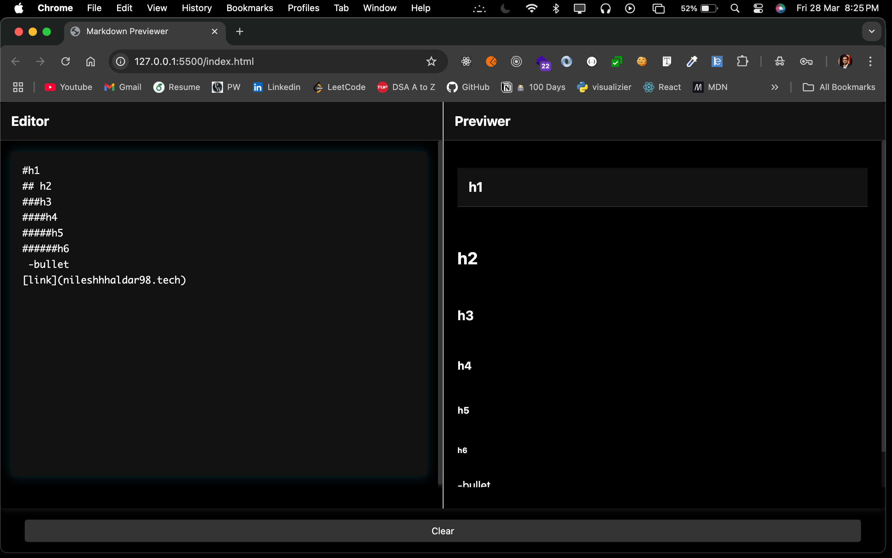

# Markdown Previewer

 Markdown previewer that allows you to write and preview Markdown in real-time. 

## Features

- Real-time Markdown preview
- Clean, dark-themed interface
- Side-by-side editor and preview panes
- Responsive design for mobile devices
- Clear button to reset content
- Support for all standard Markdown syntax

## Live Demo

Try out the live version here: [Markdown Previewer](https://mark-down-preview-kqvf.vercel.app/)

## Technologies Used

- HTML5
- CSS3
- JavaScript
- Marked.js for Markdown parsing
- Font Awesome icons

## Source Code

Check out the source code on GitHub: [GitHub Repository](https://github.com/nileshhaldar98/mark-down-preview)

## Usage

1. Open the editor on the left side
2. Start typing your Markdown content
3. See the rendered preview instantly on the right side
4. Use the Clear button to reset both panels

## Responsive Design

The interface automatically adjusts for different screen sizes:
- Desktop: Side-by-side view
- Mobile: Stacked view for better usability on smaller screens